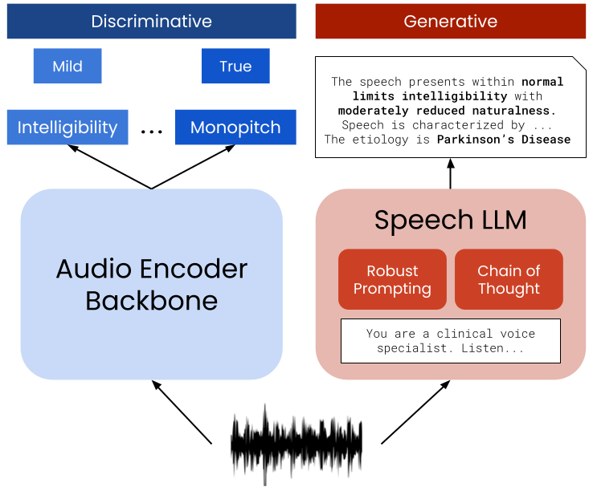

# Medical Report Generation with Speech Language Models
This repository contains the code for the paper "Medical Report Generation with Speech Language Models".

> [!IMPORTANT]  
> This repository will be made publicly available upon paper acceptance. Currently under review.

## Overview

This work introduces the first automated system for generating structured medical reports directly from pathological speech using Speech Large Language Models (SpeechLLMs). We move beyond simple classification to end-to-end audio-to-report generation, achieving significant improvements in clinical voice assessment.

## Clinical Attributes

Our system evaluates the etiology prediction plus 25 clinically relevant perceptual voice attributes:

**Voice Quality**: intelligibility, naturalness, speech rate, pitch level, loudness level overall, imprecise consonants, distorted vowels, irregular articulatory breakdowns, breathiness, strained/strangled voice, harsh voice, hoarse wet voice, voice stoppages.

**Prosodic Features**: monopitch, monoloudness, reduced stress, prolonged intervals, variable rate, short phrases.

**Resonance & Respiratory**: hypernasality, hyponasality, nasal emission, audible inspiration, forced inspiration/expiration, grunt at end of expiration.

## Models Evaluated

- `Phi-4-Multimodal`: https://huggingface.co/microsoft/Phi-4-multimodal-instruct
- `Qwen2Audio`: https://huggingface.co/Qwen/Qwen2-Audio-7B-Instruct
- `MERaLiON-2`: https://huggingface.co/MERaLiON/MERaLiON-2-10B
- `Granite-Speech`: https://huggingface.co/ibm-granite/granite-speech-3.3-8b

## Methodology

- **Dataset**: Speech Accessibility Project (SAP) with synthesized clinical reports
- **Training**: Supervised Fine-Tuning (SFT) with parameter-efficient LoRA adaptation
- **Techniques**: Chain-of-Thought prompting, instruction ensembling
- **Evaluation**: BERTScore + strict attribute matching accuracy

## Key Contributions

1. First work on direct clinical voice report generation from raw audio
2. Comparative analysis of 4 state-of-the-art SpeechLLMs
3. Investigation of Chain-of-Thought reasoning and prompt ensembling
4. Order-of-magnitude performance improvement over classification baselines
